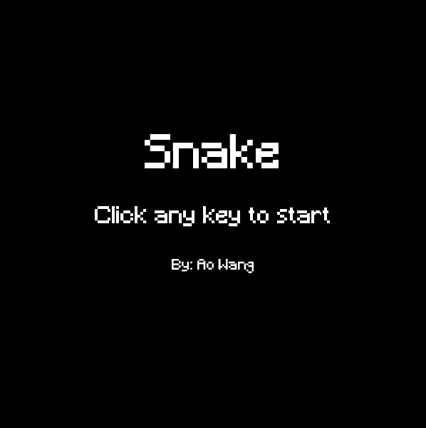

# Snake Game
## What I Learned
* Object-Oriented Programming
  * Classes, objects, instance variables, etc.
  * Constructors
* PVector, PImage, PFont classes
* Frame rates
* Keyboard and mouse functionality
  * mouseX, mouseY, keyPressed, etc.
* Strings and Drawing Text
* stroke(), fill(),  ellipse(), rect(), etc..
* List, ArrayList
* Hexadecimal color codes

## Inspiration
* https://www.openprocessing.org/sketch/106774/
* https://thecodingtrain.com/CodingChallenges/003-snake-game-p5.html 
* https://en.wikipedia.org/wiki/Snake_(video_game_genre)

